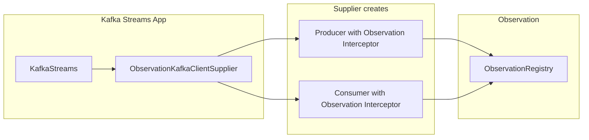

<!-- 6083e32c-a6a0-45ba-8a71-60ebbf68e5b1 -->
# Instrument Kafka Streams with Observation API (Issue #3713)

## Context

- **Issue #3713**: Instrument Kafka Streams with the Observation API so that Micrometer Tracing (and metrics) work for stream apps (e.g. Spring Boot 3 + Micrometer Tracing), as requested in spring-projects/spring-kafka#2635.
- **Kafka Streams extension point**: The only hook is **KafkaClientSupplier** (from `org.apache.kafka.streams`). Brave uses a custom supplier that returns tracing-wrapped Producer/Consumer. We will use a supplier that **injects observation via interceptors** (no need to wrap client types).
- **Existing docs**: `docs/.../observation/messaging/` and `instrumenting.adoc` show Kafka instrumentation with `ProducerInterceptor`/`ConsumerInterceptor`, `KafkaSenderContext`, and `KafkaReceiverContext` (test-only). Those patterns will be implemented as first-class binders in `micrometer-core` and reused for the supplier.

## Architecture

- **ObservationKafkaClientSupplier** (when building Kafka Streams): receives `ObservationRegistry`, and in `getProducer`/`getConsumer` copies the config, adds `KafkaProducerObservationInterceptor` or `KafkaConsumerObservationInterceptor` to the interceptor list, injects `ObservationRegistry` into config, then creates `KafkaProducer`/`KafkaConsumer`. No wrapper classes around Producer/Consumer.
- **Standalone use**: The same interceptors can be configured manually on any `KafkaProducer`/`KafkaConsumer` (as in the existing docs) by setting `INTERCEPTOR_CLASSES_CONFIG` and putting `ObservationRegistry` in config.

## Implementation Location

All new code in **micrometer-core**, package **`io.micrometer.core.instrument.binder.kafka`**. Dependencies are already present: `optionalApi libs.kafkaClients` and `optionalApi libs.kafkaStreams` (see `micrometer-core/build.gradle`). No new module.

## Components to Add

### 1. Context and convention types (Observation API pattern, like OkHttp)

- **KafkaSenderContext**  
  - Extends `SenderContext<ProducerRecord<?, ?>>` (from `io.micrometer.observation.transport`).  
  - Constructor takes a `ProducerRecord`; use `Propagator.Setter` that writes to `record.headers()`.  
  - Set carrier and use `Kind.PRODUCER`.

- **KafkaReceiverContext**  
  - Extends `ReceiverContext<ConsumerRecords<?, ?>>`.  
  - Constructor takes `ConsumerRecords`; use `Propagator.Getter` that reads from the first record’s headers (or similar strategy as in docs).  
  - Set carrier.

- **KafkaObservationDocumentation**  
  - Enum implementing `ObservationDocumentation` (from `io.micrometer.observation.docs`).  
  - Two entries, e.g. **KAFKA_PRODUCER** and **KAFKA_CONSUMER**, each with its own `getDefaultConvention()` and low-cardinality `KeyName[]` (e.g. topic, partition, outcome).  
  - Follow pattern of `OkHttpObservationDocumentation` and `OkHttpLegacyLowCardinalityTags`.

- **KafkaProducerObservationConvention** (interface extending `ObservationConvention<KafkaSenderContext>`)  
  - **DefaultKafkaProducerObservationConvention**: name `"kafka.send"`, contextual name from topic/partition, key values from record and (when available) metadata/exception (e.g. topic, partition, outcome).

- **KafkaConsumerObservationConvention** (interface extending `ObservationConvention<KafkaReceiverContext>`)  
  - **DefaultKafkaConsumerObservationConvention**: name `"kafka.receive"`, key values from records (e.g. topic, partition, count).

Use `ObservationDocumentation#observation(customConvention, defaultConvention, contextSupplier, registry)` and `.start()` when starting observations (same as OkHttp/Apache HC).

### 2. Interceptors (Kafka APIs)

- **KafkaProducerObservationInterceptor**  
  - Implements `org.apache.kafka.clients.producer.ProducerInterceptor`.  
  - `configure(configs)`: read `ObservationRegistry` from `configs.get(ObservationRegistry.class.getName())`.  
  - `onSend(record)`: build `KafkaSenderContext(record)`, create observation via `KafkaObservationDocumentation.KAFKA_PRODUCER.observation(..., () -> context, registry).start()`, store observation in a thread-local or per-call state, return `context.getCarrier()`.  
  - `onAcknowledgement(metadata, exception)`: get current observation, call `observation.error(exception)` if non-null, then `observation.stop()`.  
  - Handle concurrent sends (e.g. thread-local or scoped state keyed by record) so each send has its own observation.  
  - Public no-arg constructor (Kafka instantiates via config).

- **KafkaConsumerObservationInterceptor**  
  - Implements `org.apache.kafka.clients.consumer.ConsumerInterceptor`.  
  - `configure(configs)`: read `ObservationRegistry` from config.  
  - `onConsume(records)`: build `KafkaReceiverContext(records)`, start observation, then immediately stop (or open scope and stop after “processing” if we want to time user code; for parity with docs, start/stop in interceptor is enough).  
  - Public no-arg constructor.

Interceptors must be in a package that Kafka can load; keeping them in `io.micrometer.core.instrument.binder.kafka` is fine.

### 3. ObservationKafkaClientSupplier (Kafka Streams)

- Class: **ObservationKafkaClientSupplier** implementing **org.apache.kafka.streams.KafkaClientSupplier**.  
- **Constructor**: `ObservationKafkaClientSupplier(ObservationRegistry registry)`.  
- **getProducer(config)**:
  - Copy config (e.g. new `HashMap<>(config)`).
  - Add `ObservationRegistry.class.getName()` → registry to the copy.
  - Prepend (or append) `KafkaProducerObservationInterceptor.class.getName()` to `ProducerConfig.INTERCEPTOR_CLASSES_CONFIG` (merge with existing list if present).
  - Create and return `new KafkaProducer<>(copy)` (with appropriate serializers; Kafka Streams typically uses byte[] — ensure we don’t override user serializers; only add our interceptor and registry).
- **getConsumer(config)**: Same idea: copy config, add registry, merge `ConsumerConfig.INTERCEPTOR_CLASSES_CONFIG` with `KafkaConsumerObservationInterceptor`, create `new KafkaConsumer<>(copy)`.
- **getRestoreConsumer(config)** / **getGlobalConsumer(config)**: Delegate to `getConsumer(config)` (same as Brave).
- **getAdmin(config)**: Return `AdminClient.create(config)` (no observation needed).

Kafka Streams uses byte[] for internal clients; the interceptors work with `ProducerRecord<?,?>` and `ConsumerRecords<?,?>`, so they work regardless of key/value types.

### 4. Thread-safety for producer interceptor

Producer can have multiple in-flight sends. Each `onSend` must be tied to the same invocation’s `onAcknowledgement`. Use a **thread-local** or a **scoped key** (e.g. by record identity or a stored request-scoped key) to hold the current observation so `onAcknowledgement` stops the correct one. If multiple sends per thread are in flight, thread-local alone is not enough: use a structure that maps the “current” send (e.g. the record reference or a unique id added to the record) to the observation, and clear in `onAcknowledgement`. Simplest approach that matches Kafka’s single-threaded send callback per producer: store the observation in a thread-local in `onSend` and clear it in `onAcknowledgement` (Kafka producer typically calls onSend and onAcknowledgement from the same thread for a given record). If the client uses async send only, one observation per thread may be wrong; then we need to key by record (e.g. store in a Map keyed by record and clean up in onAcknowledgement). Prefer the thread-local approach first and document that concurrent async sends from the same thread may only attribute the last observation; improve to record-keyed if needed.

### 5. Tests

- **KafkaProducerObservationInterceptorTest**: With a test `ObservationRegistry` (e.g. `TestObservationRegistry`), create a producer config with the interceptor and registry, run a send (or mock the call path), assert observation started/stopped and key values (topic, etc.).
- **KafkaConsumerObservationInterceptorTest**: Same idea for consumer interceptor and `onConsume`.
- **ObservationKafkaClientSupplierTest**: Unit test: given an `ObservationRegistry`, instantiate `ObservationKafkaClientSupplier`, call `getProducer(config)` and `getConsumer(config)` with minimal configs; verify the returned producer/consumer config contains the observation registry and the corresponding interceptor class in the interceptor list. Optionally verify that using the supplier-created producer actually creates observations (integration-style).
- Optional: **Integration test** with Testcontainers (e.g. in same style as `ObservationMessagingIntegrationTest`) for Kafka Streams: start a stream with `ObservationKafkaClientSupplier`, produce and consume, assert observations and optionally tracing. Can be tagged and run separately if heavy.

### 6. Documentation and API surface

- **Package-info** or **Javadoc**: In `io.micrometer.core.instrument.binder.kafka`, document that Observation support is provided via interceptors and that for **Kafka Streams** users should set a custom `KafkaClientSupplier` to `ObservationKafkaClientSupplier(observationRegistry)` when building the streams app (e.g. via `StreamsConfig` or Spring’s `StreamsBuilderFactoryBean` customizer).
- **reference/kafka.adoc**: Add a section on Observation API (e.g. “Observation support”, “Kafka Streams”) describing:
  - Using the interceptors on any producer/consumer (config: `INTERCEPTOR_CLASSES_CONFIG` + `ObservationRegistry` in config).
  - Using `ObservationKafkaClientSupplier` for Kafka Streams to enable tracing and metrics without Spring controlling the clients.
- **Incubating**: Mark new public APIs (e.g. supplier, interceptors, conventions) with `@Incubating(since = "1.x")` if the project uses that for new features.

### 7. Key files to touch

| Purpose | File(s) |
|--------|---------|
| Contexts | `KafkaSenderContext.java`, `KafkaReceiverContext.java` (new) |
| Conventions & docs | `KafkaObservationDocumentation.java`, `KafkaProducerObservationConvention.java`, `DefaultKafkaProducerObservationConvention.java`, `KafkaConsumerObservationConvention.java`, `DefaultKafkaConsumerObservationConvention.java` (new) |
| Interceptors | `KafkaProducerObservationInterceptor.java`, `KafkaConsumerObservationInterceptor.java` (new) |
| Kafka Streams | `ObservationKafkaClientSupplier.java` (new) |
| Tests | `KafkaProducerObservationInterceptorTest.java`, `KafkaConsumerObservationInterceptorTest.java`, `ObservationKafkaClientSupplierTest.java` (new) |
| Docs | `docs/modules/ROOT/pages/reference/kafka.adoc` (add Observation + Kafka Streams supplier) |

### 8. Dependencies and optional loading

- No new dependencies. `ObservationKafkaClientSupplier` references `org.apache.kafka.streams.KafkaClientSupplier`; `kafka-streams` is already `optionalApi` in micrometer-core, so the class will only load when kafka-streams is on the classpath. No reflection or optional class loading is required for the supplier itself.

### 9. Optional: Spring Kafka alignment

Spring Kafka issue #3203 (“Enable KafkaStreamsMicrometerListener based on configuration”) may later document or auto-configure `ObservationKafkaClientSupplier`. This plan does not change Spring Kafka; it only provides the supplier and interceptors in Micrometer so that Spring (or any user) can plug the supplier when creating Kafka Streams.

---

## Summary

- Add first-class Kafka Observation support in **micrometer-core** (contexts, conventions, producer/consumer interceptors) following the same pattern as OkHttp and the existing docs.
- Add **ObservationKafkaClientSupplier** that injects those interceptors and the ObservationRegistry into the config for producers and consumers created by Kafka Streams, enabling metrics and tracing without wrapping client types.
- Rely on existing optional dependencies; no new module. Add unit tests and doc updates; optional integration test with Testcontainers.
